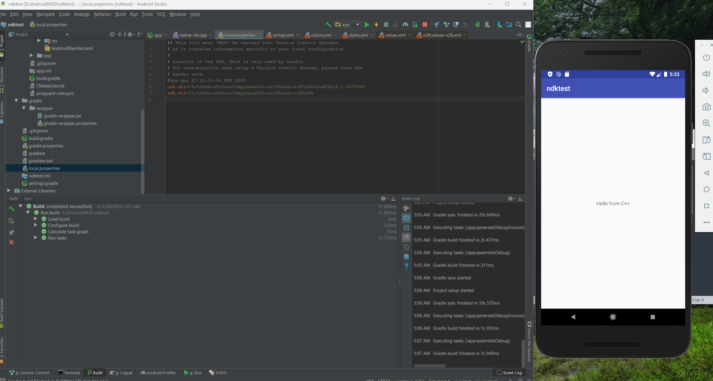

# Android NDK Test Project

This is a simple Android NDK test project, created to verify native C++ integration using Superpowered SDK for real-time audio processing.
The project is set up with the following environment:

- **NDK Version**: r16b (16.1.4479499)
- **Android Studio**: 3.2
- **Java Version**: 1.8
- **Testing Date**: 2025.04.28

## 📦 Project Structure

```
/app
    ├── src/main/cpp/        # Native C++ source files
    ├── src/main/java/       # Android Java source files
    └── res/                 # Layouts, drawables, mipmaps
/images
    └── screen1.png          # Screenshot of the app
README.md
CMakeLists.txt
build.gradle
settings.gradle
```

## ⚙️ Build Setup

- **Minimum SDK**: 27
- **Target SDK**: 27
- **Compile SDK**: 27
- **External Build System**: CMake
- **Standard**: C++11 (`-std=c++11`, with `-fno-exceptions`, `-fno-rtti` for real-time optimization)
- **Supported ABIs**: `armeabi-v7a`, `arm64-v8a`, `x86`, `x86_64`

The project uses **static linking** with `c++_static` for improved performance in real-time audio scenarios.

---

## 🚀 How to Run

1. Clone or download this project.
2. Open in Android Studio 3.2 or compatible version.
3. Make sure **NDK r16b** is installed and set correctly in `local.properties`:

    ```
    ndk.dir=/path/to/your/ndk/16.1.4479499
    ```

4. Build and run on an Android device or emulator.

> ⚠️ Note: If you are using an Android emulator, ensure that x86 and x86_64 ABIs are included in the build configuration.

---

## 💽 Screenshot

Here is a preview of the app:



---

## 🛠️ Technical Notes

- C++ code is compiled with CMakeLists.txt.
- No Java exceptions or RTTI used to ensure ultra-low latency performance.
- Project is designed for testing basic native library loading and JNI calls.

---

## 🗓️ Status

> **Testing Date**: April 28, 2025
> First stable build verified and running correctly.

---

## ✍️ Author

Developed and tested by [@tryeverything36].

---

